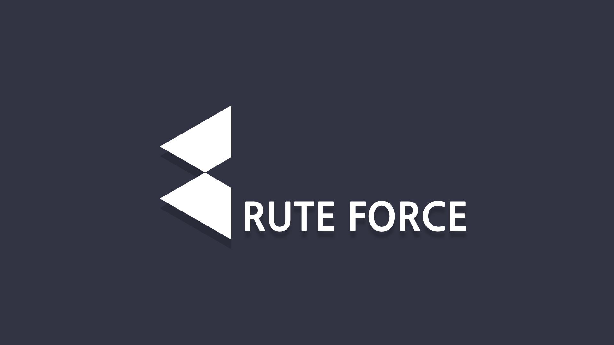

# BruteForce

↑ 깃헙 레포 바로가기

### 💡 Summary
'연희동 장사꾼' 이라는 창업 동아리에서 활동하면서 대학생을 타켓으로 하는 코딩 교육 사업인 BruteForce 프로젝트를 진행하였습니다.
사업 확장 과정에서 더 많은 학생들과 상호작용하고 학습 현황을 파악하기 위해 팀에서 웹사이트 개발을 맡게 되었습니다.
**제 첫번째 개발 프로젝트이자 개발자라는 꿈을 가지게 해준 의미있는 프로젝트입니다.**

### 👀 Bruteforce 소개
Bruteforce 의 궁극적인 목표는 대학생들에게 양질의 SW 교육 기회를 제공하는 것입니다. 대학 내에서 SW 교육이 이루어지고는 있으나,
경쟁률이 높아 수강이 가능하지 않은 경우가 많으며, 대학 외부에서 사설 교육을 받고자 하여도 금전적인 부담이나 정보의 부족,
높은 진입장벽 등의 이유로 많은 대학생들이 불편함을 느끼고 있음을 파악하였습니다. Bruteforce 는 이를 해결하고자 대학생들이 보다
쉽게 코딩 교육을 접할 수 있도록 합니다. 

Bruteforce 는 '코드잇' 이라는 온라인 코딩 교육 플랫폼과 파트너십을 체결하여 양질의 학습 자료를 제공함과 동시에
언택트 라이프로 인해 단절되어버린 학생들을 다시금 연결시킴으로써 교육의 효율성을 증진하고자 하였습니다. 언택트 라이프스타일이 
강요되면서 학생들은 '더불어 공부하는' 환경을 접하기 어려워졌습니다. Bruteforce 는 대학생들을 위한 지속가능한 커리큘럼을 
제공함과 동시에 타학생들과 함께 스터디하는 비대면 환경을 구축하여 비전공자 혹은 초보자들이 더불어 프로그래밍을 배우고
협력하며 성장할 수 있도록 격려합니다.

*Bruteforce 팀은 2019년부터 2021년 까지 유지되었으며, 이후 활동 종료되었습니다.*

#### 🗓 2021.07 ~ 2021.12

#### 📋 Features
* 회원 관리: 로그인/로그아웃, 회원가입
* 주차별 학습 현황 기록 및 조회
* 학습 포인트를 이용한 기프티콘 구매 신청
* 학습 인증
* 질문게시판 및 학습 자료실
* 관리자 페이지를 통한 수강생 정보 조회 및 각종 정보 입력

#### 🛠 Tech Stack
* Python, Django, HTML5, CSS3, JavaScript, Bootstrap, MySQL, Sentry,
* Deployment
  * 1차 배포: AWS Lightsail 
  * 2차 배포: AWS S3, EC2, RDS

### 🔎 Background
코딩 지식이 기본 소양으로 요구되고 있어 대학생들의 코딩 학습 수요는 증가했지만
적절한 공급이 부족하다는 pain point를 포착하여 Brute Force 라는 사업을 진행하게 되었습니다.
수강생이 적었던 초기 단계에서는 엑셀로 수강생 정보를 관리할 수 있었으나 수강생이 점차 늘어나고 홍보의 필요성이 커짐에 따라 
웹사이트가 필요하게 되었고 처음으로 웹풀스택 공부를 하게 되었습니다.

### 📌 Takeaways
사업을 진행하면서 필요에 의해 진행하게 된 프로젝트였지만 처음으로 개발자라는 꿈을 꾸게 해준 프로젝트이기에 굉장한 의미가 있습니다.
오픈소스를 통해 Django를 이용한 웹풀스택 개발과 MySql을 이용한 데이터베이스의 CRUD 에 대해 스스로 학습하며 
2개월이라는 시간 안에 프로젝트 웹사이트를 배포해낼 수 있었습니다. 상대적으로 짧은 시간이었기에 마감 기간에 쫓기기도 했지만, 
페이지가 하나씩 만들어지고 정상적으로 작동하는 것을 확인하며 뿌듯해하고, 오랜 시간 고민하며 디버깅을 하는 과정을 거치면서 웹개발에 대한 제 관심과 열정을 확인할 수 있었습니다. 
처음에는 웹개발이라는 분야가 생소하고 관련된 지식과 기술이 부족했지만 프로그래밍에 대한 흥미와 열정이 있었기에 단기간에 큰 성과를 이루어낼 수 있었습니다.

***

### 프로젝트의 자세한 내용은 웹사이트를 참고해주세요!

__참고! 현재 운영중인 웹사이트가 아니라 곳곳에 더미 데이터가 포함되어 있습니다 :(__

[BruteForce 웹사이트 둘러보기](https://bruteforceuniv.com)

로그인해서 둘러보고 싶다면?

아이디: test123  
비밀번호: testb-f!  
