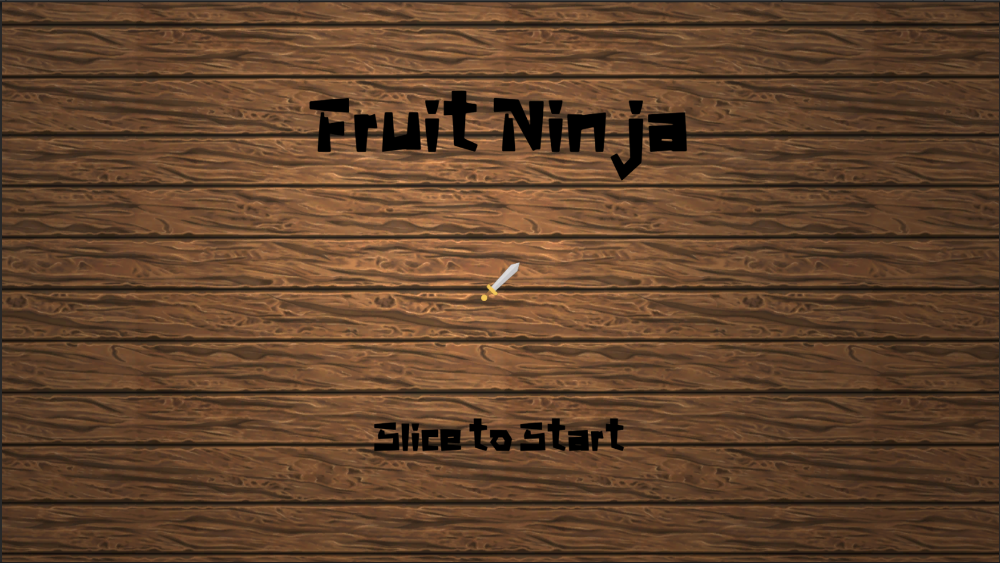

# Fruit Ninja

[깃헙 레포 바로가기](https://github.com/linda2927/FruitNinja.git)

### 💡 Summary
Fruit Ninja 게임을 벤치마킹한 3D Hand Recognition 버전의 새로운 Fruit Ninja 게임

### 👀 Fruit Ninja 3D 소개

* __게임 이름:__ Fruit Ninja 3D
* __게임 장르:__ 캐주얼 액션
* __목표:__ 하늘에서 떨어지는 과일을 베어 점수를 획득하고, 폭탄을 잡아 쓰레기통에 버려 높은 점수를 획득한다.
* __설명:__ 과일을 벨 때마다 점수가 누적되며 폭탄을 베면 (slice) 게임이 종료된다. 하늘에서 떨어지는 폭탄을 잡아  (grab) 쓰레기통에 버려야한다. 기회는 총 3번이며, 과일이 바닥에 닿을 때마다 하나씩 차감된다.

#### 🍉 구성요소

* __Spawner:__ Fruit 과 Bomb 오브젝트를 반복적으로 생성하여 떨어뜨린다.
* __Fruit:__ 총 5 종류 (수박, 사과, 레몬, 키위, 오렌지) 이며 베면 반으로 갈라진다. 베지 못하고 바닥에 떨어진다면 기회가 차감된다.
* __Hand:__ 플레이어의 손의 위치와 모양에 따라 게임의 오브젝트들과 상호작용한다. Slice 모드와 Grab 모드가 있다.
* __Bomb:__ 과일과 함께 위에서 떨어지며 베거나 바닥에 닿을 경우 터지면서 게임이 종료된다. 이를 막기 위해 폭탄을 잡아 쓰레기통에 가져다 두어야 한다.
* __Bin:__ Bomb 를 버리는 곳이다.
* __Game Manager:__ UI 관련 로직을 포함하여 게임을 진행함에 있어 필요한 데이터들을 관리하는 오브젝트이다.

#### 🍉 Scene 구성

* __Start:__ 떨어지는 수박을 베면 게임 설명 씬으로 넘어간다.

* __HowTo:__ 게임의 룰이 설명되어 있다. 버튼을 누르면 게임이 시작된다.

* __Game:__ 실제 게임을 플레이하는 씬이다.

#### 🗓 2022.12

#### 🗓 Collaborators
본 프로젝트는 응용프로그래밍 수업에서 팀 프로젝트의 일환으로 진행한 것으로 총 3명이서 함께 작업한 결과물이다.
Server, Client, Unity 부분으로 나누어 작업했으며, 나는 Unity 를 통한 시각화를 맡아 피처들을 구현했다.

### 📋 Features
* 서버에서부터 받아온 손의 위치 및 모양에 따라 Hand 오브젝트 구현
* 손의 모양에 따라 베거나 잡는 동작 구현
* 과일을 벨 때 속도와 방향에 따라 반으로 갈라지는 모션 구현
* 유니티 coroutine 을 사용한 오브젝트 spawner
* 기본적인 게임 UI 구현
* Scene 전환
* Game Manager 을 통한 Scene 및 게임 정보 관리
* 다양한 Audio Source 적용

### 🛠 Tech Stack
* Unity, C Sharp, Python, Media Pipe, Redis, Docker, Flask
* Windows Build, MacOS Build

### 📌 Takeaways
기술적인 문제들을 제외하고 유니티 스크립트를 작성함에 있어서 가장 많이 고민을 했던 부분은 GameManager 클래스에 대한 것이었다.
GameManager 는 UI 관련 로직, 남은 기회, 현재 게임 상황 등 게임 진행에 필요한 데이터들을 모두 다 담고 있다. 싱글톤 패턴에 착안하여
하나의 GameManager 인스턴스가 게임을 통제할 수 있도록 하는 것이 목표였기에 많은 변수들과 메소드들을 담게 되었는데, 실제 구동에는 문제가 없었지만
많은 클래스들에서 GameManager 클래스의 변수나 메소드를 가져다 쓰면서 보안 이슈들이 생길 여지가 많겠다는 생각이 들었다.
변수와 메소드의 접근 제어자와 static 여부를 처리한 부분이 미흡하고 객체지향적인 면이 부족했던 것 같다. 
객체지향적 프로그래밍에 대한 이해도를 보다 높여야할 필요성을 느끼게 해준 프로젝트였다.

